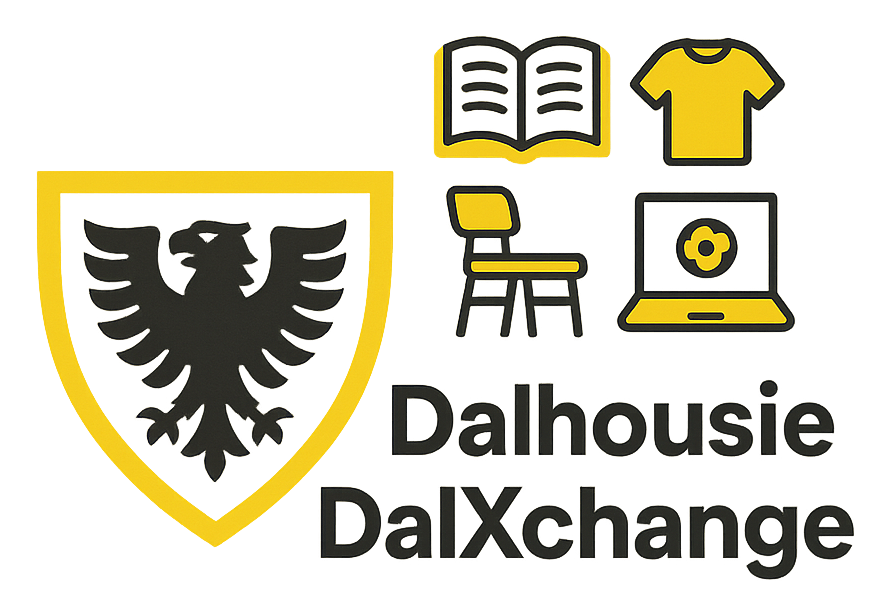
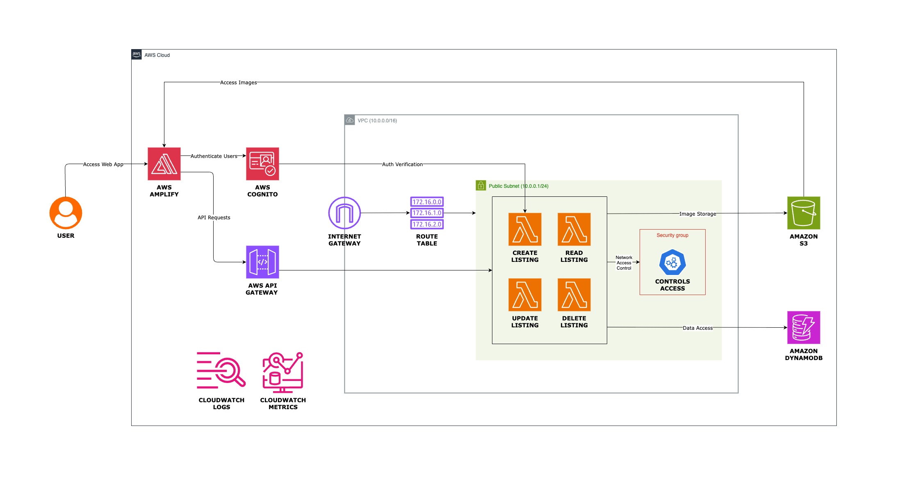

  

## What is DalXchange?

DalXchange is a modern, full-stack web application designed for listing and exchanging items within a Dalhousie University student community. The platform enables users to post, browse, and manage item listings, facilitating secure and efficient exchanges. DalXchange leverages AWS cloud infrastructure for scalability, reliability, and security, using Terraform for infrastructure-as-code, a React frontend for a seamless user experience, and a Python FastAPI backend for robust API services.

### Key Features

- User authentication and management via AWS Cognito
- Secure item listing and exchange workflows
- Image upload and storage using AWS S3
- Fast, serverless backend powered by AWS Lambda and FastAPI
- Responsive frontend built with React and hosted on AWS Amplify
- Scalable data storage using AWS DynamoDB
- Infrastructure managed and provisioned with Terraform

---

### Architecture Diagram

  

---

### Demo Video

Check out the project demo video here:
[documentation/DalXchange.mp4](documentation/DalXchange.mp4)

## Repository Structure

- [backend/README.md](backend/README.md) — Details about the Python FastAPI backend, including API endpoints, dependencies, and setup instructions.
- [frontend/README.md](frontend/README.md) — Details about the React frontend, including features, setup, and development workflow.
- [terraform/README.md](terraform/README.md) — Details about the AWS infrastructure as code, including architecture, deployment, and resource descriptions.

---

©Developed by Het Patel. All rights reserved.
